

  

<strong>Türkçe</strong> · <a href="./README.md">English</a>

# Etsy Automation Tools for Sellers

Etsy satıcıları için açık kaynak Etsy automation tools ve Tampermonkey userscript koleksiyonu. Paket; Etsy Sales and Discounts, müşteri mesajları, Etsy Ads anahtar kelimeleri, listing analizi ve Etsy SEO keyword research iş akışlarını tek depoda toplar.

> Bu proje Etsy tarafından geliştirilmiş, desteklenmiş veya onaylanmış resmî bir araç değildir.

## Scriptler

| Script | Sürüm | Amaç |
|---|---:|---|
| [Makaytron Etsy Sale Manager](./scripts/etsy-sale-campaign-batch-runner/README.md) | 1.0.11 | Bulk Sales & Discounts Automation ile Etsy kampanyalarını kontrollü, doğrulamalı ve fail-closed seriler hâlinde planlar ve raporlar. |
| [Makaytron Etsy Message Assistant](./scripts/etsy-message-assistant/README.md) | 1.0.3 | Mesaj çevirisi, cevap taslağı, şablon ve kullanıcı tarafından seçilen AI sağlayıcıları için yardımcı panel sunar. |
| [Makaytron Etsy Ads Keyword Manager](./scripts/etsy-ads-keyword-manager/README.md) | 1.0.3 | Form tabanlı filtrelerle mevcut sayfadaki eşleşmeleri açıp kapatır; açık onayla tüm sayfalardaki eşleşmeleri kapatır. |
| [Makaytron Etsy Listing Analyzer](./scripts/etsy-listing-analyzer/README.md) | 1.0.5 | Tüm sayfaları tek komutla sırayla toplar, ilk sayfaya dönünce analizi açar; yeniden deneme, hata raporu, presetler, grafikler, AI karşılaştırması ve Health Engine sunar. |
| [Makaytron Etsy Keyword & Market Analyzer](./scripts/etsy-keyword-market-analyzer/README.md) | 1.0.3 | Marketplace Insights metriklerini görünür DOM'dan okur, keyword satırlarının altında açıklar ve isteğe bağlı olarak Listing Analyzer'a kanıtlı araştırma sonucu gönderir; Listing Analyzer öneriyi bu kanıttan üretir. |

Listing Analyzer ve Keyword & Market Analyzer ayrı ayrı kurulup kullanılabilir. Listing Analyzer'daki pazar araştırması özelliği kullanıcı tarafından başlatıldığında companion bulunamazsa neden gerekli olduğunu açıklar; yalnız kullanıcının **Yükleme sayfasını aç** onayından sonra canonical userscript adresini açar. Son kurulum onayı her zaman Tampermonkey'e ve kullanıcıya aittir.

## Sentetik panel galerileri

Bu görseller gerçek userscript kaynağının ağ erişimi kapalı sentetik fixture'da oluşturduğu **bağımsız panel/modal öğelerinden** çekilir. Etsy ya da başka bir site arka planı, tarayıcı çerçevesi ve gerçek hesap/mağaza/müşteri/sipariş verisi içermez.

### Makaytron Etsy Sale Manager

| Genel panel | Ayarlar |
|---|---|
| 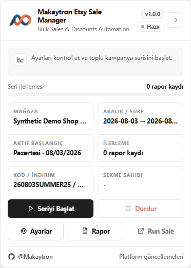 | 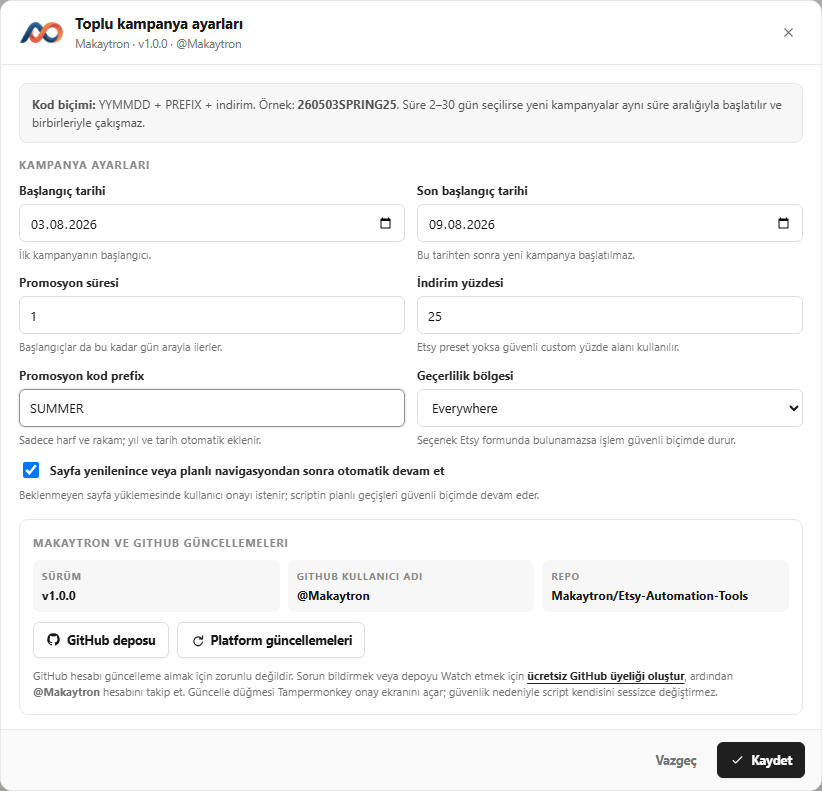 |

| Güvenli duraklatma | Seri raporu |
|---|---|
| 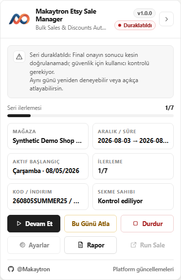 | 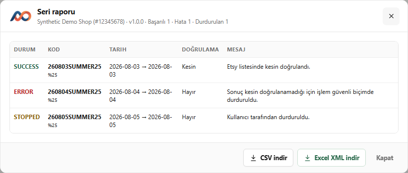 |

### Makaytron Etsy Message Assistant

| Mesaj çalışma alanı | Yanıt inceleme |
|---|---|
| 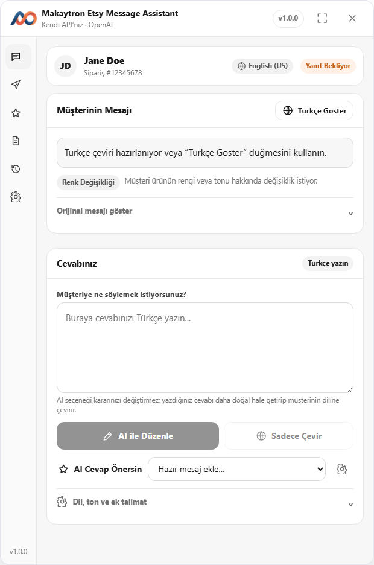 | 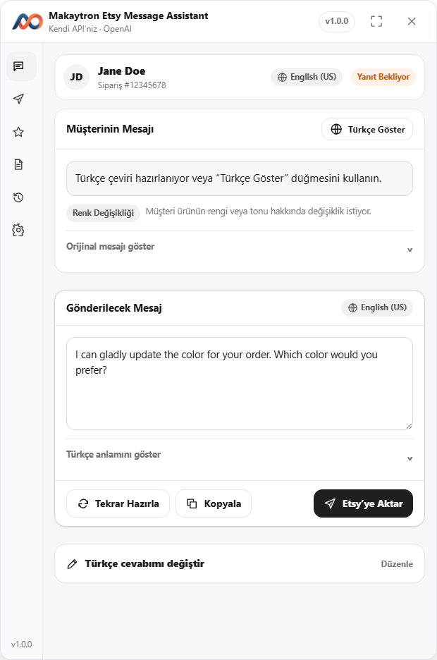 |

| Şablonlar | Ayarlar |
|---|---|
| 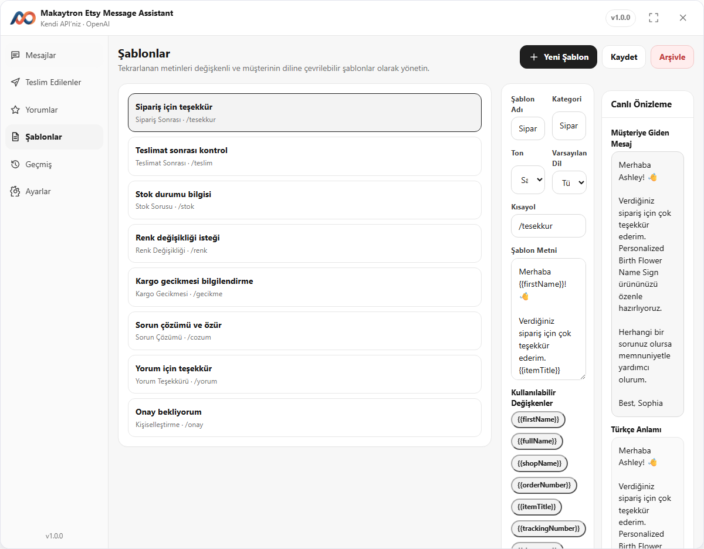 | 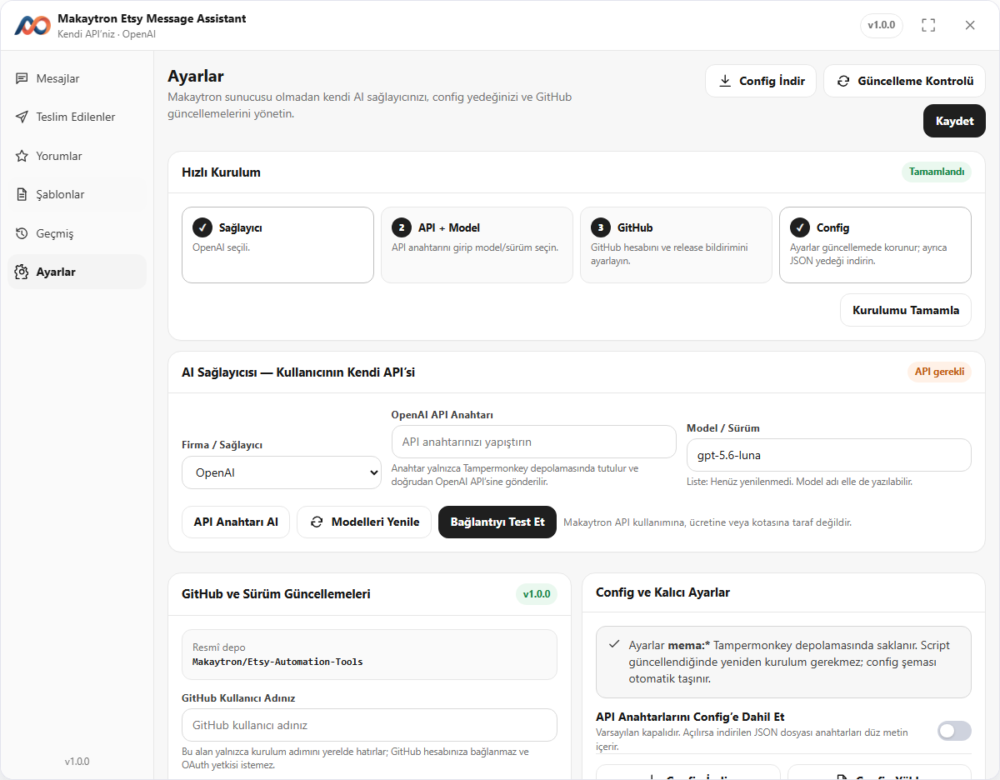 |

### Makaytron Etsy Ads Keyword Manager

| Ana panel | Anahtar kelime kural editörü |
|---|---|
| 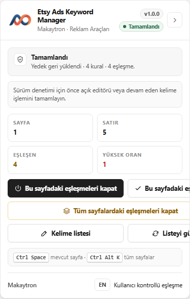 | 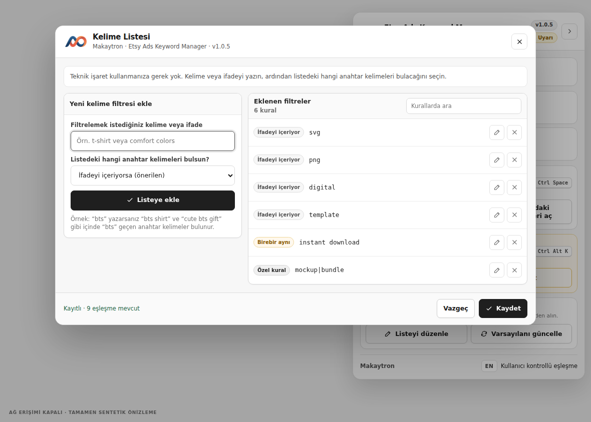 |

### Makaytron Etsy Listing Analyzer

| Genel bakış | Listing analizleri |
|---|---|
| 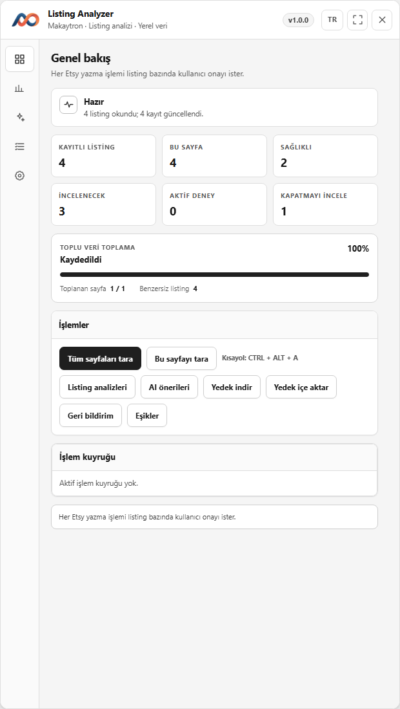 | 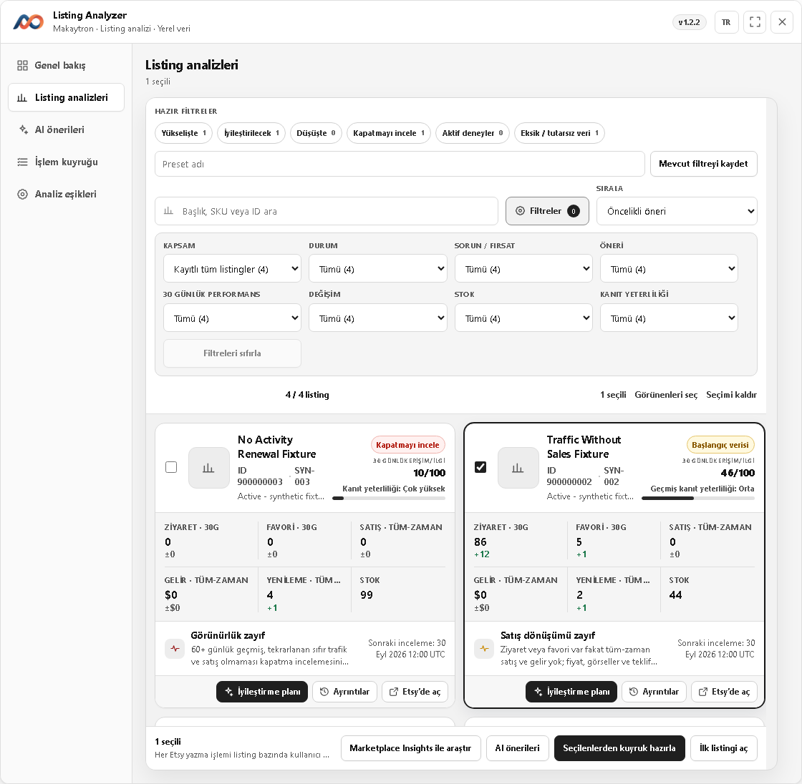 |

| AI önerileri | İşlem kuyruğu |
|---|---|
| 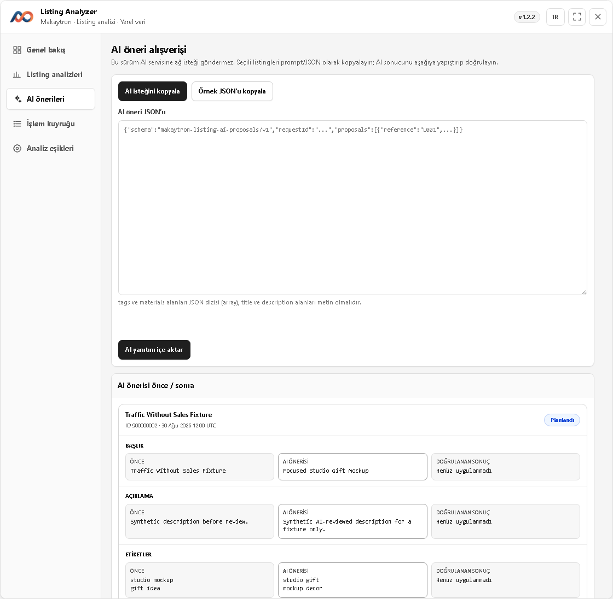 | 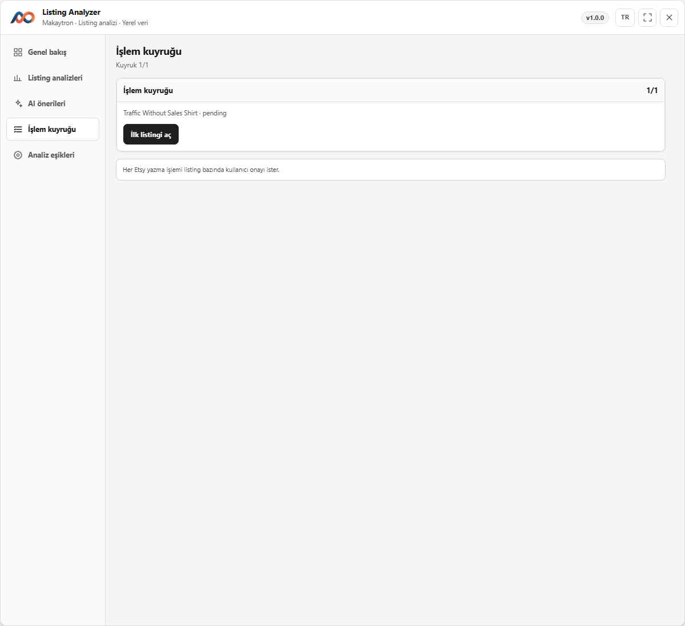 |

Listing seçimi öneri kaydetmez; yalnız araştırma, AI dışa aktarımı ve kuyruk kapsamını belirler. Önce **İyileştirme planı**ndan manuel öneriyi kaydedin veya doğrulanmış AI JSON’unu içe aktarın; ardından kaydedilmiş önerisi bulunan kartları seçerek kuyruğu oluşturun. Form uygulama ve Etsy Publish onayı listing bazındadır; doğrulanamayan işlem otomatik tekrarlanmaz. [Akışın tamamını okuyun.](./scripts/etsy-listing-analyzer/README.md#kullanım)

| Analiz eşikleri |
|---|
| 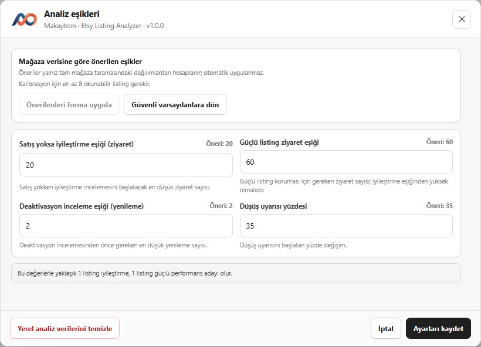 |

### Makaytron Etsy Keyword & Market Analyzer

| Hazır panel | Araştırma talebi |
|---|---|
| 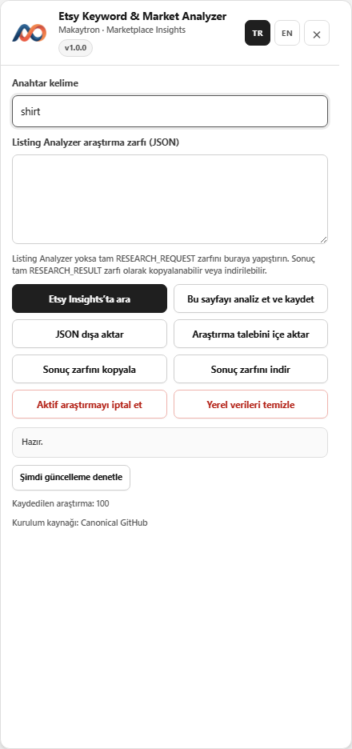 |  |

| Sonuç zarfı |
|---|
| 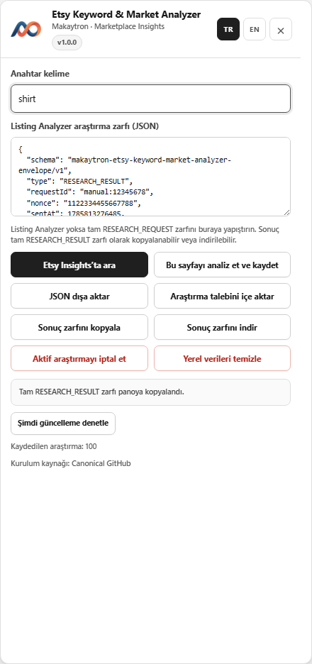 |

## Kurulum

1. [Tampermonkey](https://www.tampermonkey.net/) kurun.
2. Kullanmak istediğiniz scriptin bağlantısını açın:
   - [Makaytron Etsy Sale Manager'ı yükle](https://raw.githubusercontent.com/Makaytron/Etsy-Automation-Tools/main/scripts/etsy-sale-campaign-batch-runner/Etsy-Sale-Campaign-Batch-Runner.user.js)
   - [Makaytron Etsy Message Assistant'ı yükle](https://raw.githubusercontent.com/Makaytron/Etsy-Automation-Tools/main/scripts/etsy-message-assistant/Makaytron-Etsy-Message-Assistant.user.js)
   - [Makaytron Etsy Ads Keyword Manager'ı yükle](https://raw.githubusercontent.com/Makaytron/Etsy-Automation-Tools/main/scripts/etsy-ads-keyword-manager/Makaytron-Etsy-Ads-Keyword-Manager.user.js)
   - [Makaytron Etsy Listing Analyzer'ı yükle](https://raw.githubusercontent.com/Makaytron/Etsy-Automation-Tools/main/scripts/etsy-listing-analyzer/Makaytron-Etsy-Listing-Analyzer.user.js)
   - [Makaytron Etsy Keyword & Market Analyzer'ı yükle](https://raw.githubusercontent.com/Makaytron/Etsy-Automation-Tools/main/scripts/etsy-keyword-market-analyzer/Makaytron-Etsy-Keyword-Market-Analyzer.user.js)
3. Tampermonkey izinlerini inceleyin ve **Yükle** düğmesiyle onaylayın.

Ayrıntılı kullanım ve güvenlik bilgileri her scriptin kendi README dosyasındadır.

## Ayrı kullanım rehberleri

| Script | Adım adım kullanım |
|---|---|
| Makaytron Etsy Sale Manager | [Türkçe](./scripts/etsy-sale-campaign-batch-runner/USAGE.md) · [English](./scripts/etsy-sale-campaign-batch-runner/USAGE.en.md) |
| Makaytron Etsy Message Assistant | [Türkçe](./scripts/etsy-message-assistant/USAGE.md) · [English](./scripts/etsy-message-assistant/USAGE.en.md) |
| Makaytron Etsy Ads Keyword Manager | [Türkçe](./scripts/etsy-ads-keyword-manager/USAGE.md) · [English](./scripts/etsy-ads-keyword-manager/USAGE.en.md) |
| Makaytron Etsy Listing Analyzer | [Türkçe](./scripts/etsy-listing-analyzer/USAGE.md) · [English](./scripts/etsy-listing-analyzer/USAGE.en.md) |
| Makaytron Etsy Keyword & Market Analyzer | [Türkçe](./scripts/etsy-keyword-market-analyzer/USAGE.md) · [English](./scripts/etsy-keyword-market-analyzer/USAGE.en.md) |

## Dağıtım ve güncellemeler

Kanonik kaynak GitHub'dır. Beş Greasy Fork kaydı tam public Raw yollarından otomatik eşitlenir; yalnız GitHub Release olayına bağlı webhook da yayın anında hemen yenileme ister. Greasy Fork'a GitHub tokenı veya repoya yazma izni verilmez. Kanal haritası ve güvenlik modeli [DISTRIBUTION.md](./DISTRIBUTION.md) dosyasındadır.

## Güvenli kullanım

- İlk canlı kampanya çalıştırmasını tek gün ve düşük riskli ayarlarla yapın; sonucu Etsy ekranında elle doğrulayın.
- Etsy Sale Manager'daki **Seriyi Başlat** düğmesi canlı yazma yetkisidir; ardından script her kampanyanın Etsy final gönderim düğmesini otomatik tıklar.
- Mesaj asistanındaki taslakları Etsy'ye göndermeden önce okuyun. Otomatik gönderim varsayılan olarak kapalıdır.
- Ads Keyword Manager'daki **Bu sayfadaki eşleşmeleri kapat/aç** işlemleri görünür Etsy kontrollerini değiştirir. **Tüm sayfalardaki eşleşmeleri kapat** yalnız açık onaydan sonra çalışır; sonucu Etsy Ads ekranında elle doğrulayın.
- Listing Analyzer Health Engine analizleri yalnız görünür Etsy metrikleri ve tarayıcıdaki yerel geçmişe dayanan karar desteğidir. Yaşam döngüsü, cohort, güven, kanıt ve deney sonuçları nedensellik veya Etsy geneli benchmark iddiası değildir; listing iyileştirme, deaktif etme veya diğer toplu yazma işlemleri yalnız açık kullanıcı seçimi ve onayından sonra çalıştırılmalıdır.
- Listing Analyzer `v1.0.5` AI ağına bağlanmaz: anonimleştirilebilir istek JSON'u/prompt'u dışa aktarır ve doğrulanmış teklif JSON'u içe alır. Her listing Etsy Publish öncesinde kullanıcı onayı bekler; deaktif etmede script yalnız seçenek menüsünü açıp ilgili öğeye odaklanır, Deactivate ve Etsy final onayını kullanıcı tıklar. Delete otomatikleştirilmez.
- Keyword & Market Analyzer yalnız açık Marketplace Insights sayfasında render edilmiş keyword, arama, arama sonucu ve trend verilerini okur. Kullanıcı araştırmayı başlattığında seed keyword normal Marketplace Insights arama navigasyonunda Etsy'ye `query` olarak gönderilir ve Etsy araştırma kotasını/sorgu maliyetini tüketebilir. “Fırsat” değeri Makaytron'un türetilmiş sinyalidir; Etsy'nin kesin rekabet veya satış tahmini değildir. Araştırma sonucu listing'i otomatik değiştirmez.
- İki analyzer birlikte kullanıldığında başlık, tag, anonim yerel referans ve içerik hash'i sürümlü/son kullanma süreli bir tarayıcı mesajıyla aktarılır. Süresi dolmuş, yinelenen veya değişmiş içeriğe ait sonuç reddedilir; araştırma kanıtından yerelde üretilen öneri yine kullanıcı incelemesine gider.
- API anahtarlarını, çerezleri, müşteri/sipariş verilerini, mağaza/listing kimliklerini veya reklam metriklerini issue ve ekran görüntülerinde paylaşmayın.
- Message Assistant'ın otomatik Türkçe önizlemesi varsayılan olarak açıktır; mesaj sayfası açıldığında son müşteri mesajı Google Translate'e gönderilebilir. İstemiyorsanız mesaj sayfasına gitmeden önce Tampermonkey menüsündeki Makaytron ayarlarından kapatın.
- Message Assistant içindeki AI veya çeviri sağlayıcıları kullanıldığında ilgili metin seçilen üçüncü taraf API'sine gönderilir.
- Psödonimleştirilmiş kullanım telemetrisi ilk kullanımda görünür bildirimle varsayılan açıktır; Ayarlar'daki tek tık kapatma sunucu tarafındaki kaydın silinmesini ister. Yalnız sınırlı günlük açılma, başarılı kullanım ve kategorize hata sinyalleri ölçülür; ham hata metni, Etsy içeriği veya hesap verisi toplanmaz.

Destek için [SUPPORT.md](./SUPPORT.md), güvenlik bildirimleri için [SECURITY.md](./SECURITY.md) ve veri işleme ayrıntıları için [PRIVACY.md](./PRIVACY.md) dosyasını okuyun. İlk kullanıcı kontrollü denemeden önce Etsy Sale Manager için [tek günlük dry-run listesini](./docs/campaign-dry-run-checklist.md), Listing Analyzer için [listing dry-run listesini](./docs/listing-analyzer-dry-run-checklist.md), Keyword & Market Analyzer için [keyword araştırma dry-run listesini](./docs/keyword-market-analyzer-dry-run-checklist.md) uygulayın.

## Lisans

Bu depo [MIT Lisansı](./LICENSE) ile yayımlanır.
