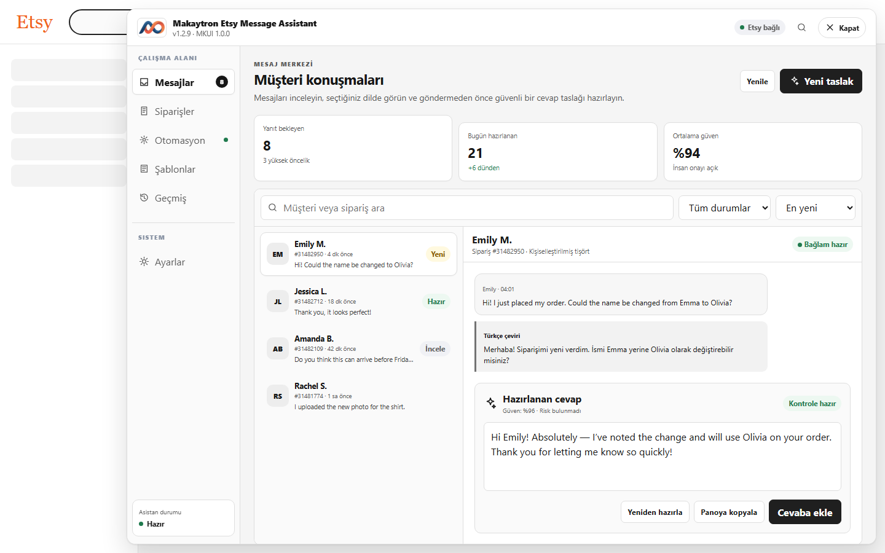
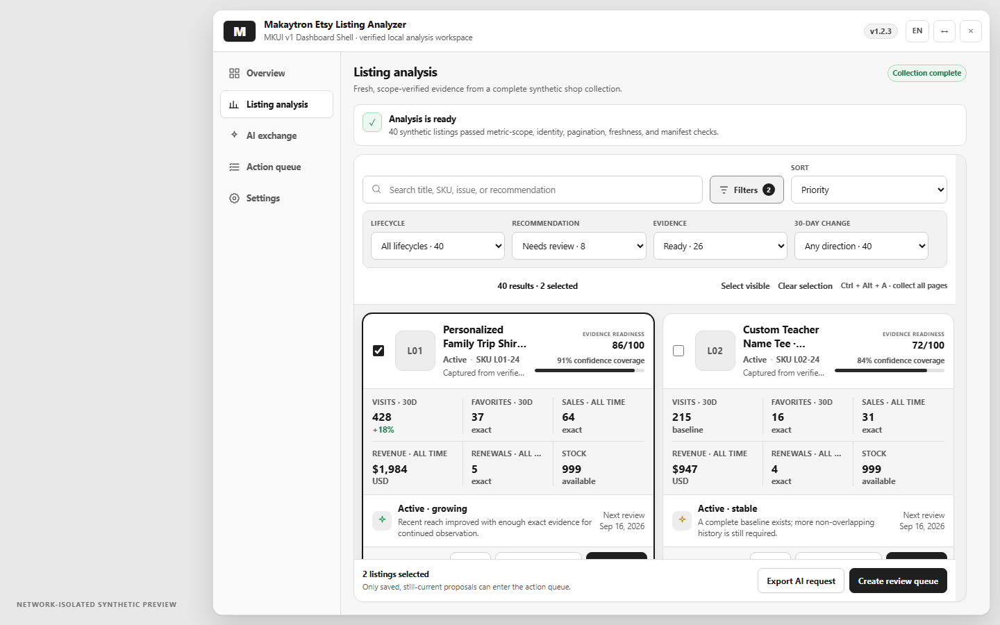

  

<strong>Türkçe</strong> · <a href="./README.md">English</a>

# Etsy Automation Tools for Sellers

Etsy satıcıları için açık kaynak Etsy automation tools ve Tampermonkey userscript koleksiyonu. Paket; Etsy Sales and Discounts, müşteri mesajları, Etsy Ads anahtar kelimeleri, listing analizi ve Etsy SEO keyword research iş akışlarını tek depoda toplar.

> Bu proje Etsy tarafından geliştirilmiş, desteklenmiş veya onaylanmış resmî bir araç değildir.

## Scriptler

| Script | Sürüm | Amaç |
|---|---:|---|
| [Makaytron Etsy Sale Manager](./scripts/etsy-sale-campaign-batch-runner/README.md) | 1.0.13 | Bulk Sales & Discounts Automation ile Etsy kampanyalarını kontrollü, doğrulamalı ve fail-closed seriler hâlinde planlar ve raporlar. |
| [Makaytron Etsy Message Assistant](./scripts/etsy-message-assistant/README.md) | 1.2.9 | Rol ayrımlı konuşma çevirisi, doğrulamalı hızlı cevaplar ve yorum cevap taslakları sunarken açık opt-in ile alıcıları tek tek işleyen Otopilotu korur. |
| [Makaytron Etsy Ads Keyword Manager](./scripts/etsy-ads-keyword-manager/README.md) | 1.0.5 | Form tabanlı filtrelerle mevcut sayfadaki eşleşmeleri açıp kapatır; açık onayla tüm sayfalardaki eşleşmeleri kapatır. |
| [Makaytron Etsy Listing Analyzer](./scripts/etsy-listing-analyzer/README.md) | 1.2.3 | Tüm sayfaları sırayla toplar, Etsy metrik kapsamını doğrular; aktif dönem analizi, bağlamlı kohortlar, exact deney aralıkları, veri-kaliteli grafikler, AI karşılaştırması ve Health Engine sunar. |
| [Makaytron Etsy Keyword & Market Analyzer](./scripts/etsy-keyword-market-analyzer/README.md) | 1.0.4 | Marketplace Insights metriklerini görünür DOM'dan okur, keyword satırlarının altında açıklar ve isteğe bağlı olarak Listing Analyzer'a kanıtlı araştırma sonucu gönderir; Listing Analyzer öneriyi bu kanıttan üretir. |

Listing Analyzer ve Keyword & Market Analyzer ayrı ayrı kurulup kullanılabilir. Listing Analyzer'daki pazar araştırması özelliği kullanıcı tarafından başlatıldığında companion bulunamazsa neden gerekli olduğunu açıklar; yalnız kullanıcının **Yükleme sayfasını aç** onayından sonra canonical userscript adresini açar. Son kurulum onayı her zaman Tampermonkey'e ve kullanıcıya aittir.

## Zorunlu tasarım kaynakları

Bu depoya eklenecek bütün yeni sayfalar, paneller ve görünür bileşenler kaynak kilidine tabidir. Arayüzler gelişigüzel oluşturulmayacak; aşağıdaki onaylı kaynaklardan doğrudan uyarlanacaktır:

1. [Makaytron/Tamplate-Back-White-01](https://github.com/Makaytron/Tamplate-Back-White-01) — ana uygulama template'i; shell, sol menü, header, kart, form, tablo, spacing ve tema yapısının birincil kaynağıdır.
2. [Makaytron/Toast-01](https://github.com/Makaytron/Toast-01) — toast, snackbar ve geçici bildirimlerin davranış ve görünümünde zorunlu kaynaktır.
3. [Uygulanmış ShadcnStore dashboard](https://shadcnstore.com/templates/dashboard/shadcn-dashboard-landing-template/dashboard) — sidebar/header/content bütünlüğü ve tam dashboard kompozisyonu için referanstır.
4. [ShadcnStore blocks](https://shadcnstore.com/blocks) — uygulama, dashboard, veri, form, filtre, tablo, kart, uyarı ve boş durum bloklarının onaylı kataloğudur.

Önemli her arayüz değişikliğinde kullanılan repo yolu veya ShadcnStore blok adı/numarası açıkça yazılmalıdır. Sayfa eklerken kafadan kart, menü, modal, tablo, boş durum, toolbar, loader, uyarı ya da toast üretilmeyecektir. Uygun kaynak bulunamazsa geliştirme durdurulur; uygulamadan önce maintainer onaylı bir tasarım boşluğu kaydı açılır.

Userscriptler çalışma anında framework bağımlılığı taşımaz: React/Tailwind tabanlı onaylı örnekler yerel, framework'süz ve scope edilmiş MKUI koduna uyarlanır; React, Tailwind, Toast-01 veya ShadcnStore ağdan yüklenmez. Mevcut davranış, gizlilik, onay ve belirsizlikte durma sözleşmeleri görsel referanslardan önce gelir.

Kesin kurallar [Zorunlu Tasarım Kaynağı Kilidi](./docs/design/DESIGN-SOURCE-LOCK.md) belgesindedir.

Onaylı kaynak kimlikleri ve kesin konumları [DESIGN-SOURCE-REGISTRY.json](./docs/design/DESIGN-SOURCE-REGISTRY.json) içinde kilitlidir. Her UI pull request bu kayıtlı kimlikleri belirtmelidir; yalnız repo adı, genel katalog URL'si veya “benzeri” açıklaması kabul edilmez.

## Sentetik panel galerileri

Bu görseller gerçek userscript kaynağının ağ erişimi kapalı sentetik fixture'da oluşturduğu **bağımsız panel/modal öğelerinden** çekilir. Etsy ya da başka bir site arka planı, tarayıcı çerçevesi ve gerçek hesap/mağaza/müşteri/sipariş verisi içermez.

### Makaytron Etsy Sale Manager

| Genel panel | Ayarlar |
|---|---|
|  |  |

| Güvenli duraklatma | Seri raporu |
|---|---|
|  |  |

### Makaytron Etsy Message Assistant

| MKUI çalışma alanı önizlemesi |
|---|
|  |

> Production `1.2.9` CSS katmanlarından, ağ erişimi kapalı tamamen sentetik fixture ile üretilmiştir. Gerçek hesap, mağaza, müşteri veya sipariş verisi içermez.
### Makaytron Etsy Ads Keyword Manager

| Ana panel | Anahtar kelime kural editörü |
|---|---|
|  |  |

### Makaytron Etsy Listing Analyzer

| MKUI dashboard önizlemesi |
|---|
|  |

> Production `1.2.3` CSS katmanından ağ erişimi kapalı sentetik fixture ile üretilmiştir. Gerçek mağaza, listing veya Etsy hesabı verisi içermez.

| Genel bakış | Listing analizleri |
|---|---|
|  |  |

| AI önerileri | İşlem kuyruğu |
|---|---|
|  |  |

Listing seçimi öneri kaydetmez; yalnız araştırma, AI dışa aktarımı ve kuyruk kapsamını belirler. Önce **İyileştirme planı**ndan manuel öneriyi kaydedin veya doğrulanmış AI JSON’unu içe aktarın; ardından kaydedilmiş önerisi bulunan kartları seçerek kuyruğu oluşturun. Form uygulama ve Etsy Publish onayı listing bazındadır; doğrulanamayan işlem otomatik tekrarlanmaz. [Akışın tamamını okuyun.](./scripts/etsy-listing-analyzer/README.md#kullanım)

| Analiz eşikleri |
|---|
|  |

### Makaytron Etsy Keyword & Market Analyzer

| Hazır panel | Araştırma talebi |
|---|---|
|  |  |

| Sonuç zarfı |
|---|
|  |

## Kurulum

1. [Tampermonkey](https://www.tampermonkey.net/) kurun.
2. Kullanmak istediğiniz scriptin bağlantısını açın:
   - [Makaytron Etsy Sale Manager'ı yükle](https://raw.githubusercontent.com/Makaytron/Etsy-Automation-Tools/main/scripts/etsy-sale-campaign-batch-runner/Etsy-Sale-Campaign-Batch-Runner.user.js)
   - [Makaytron Etsy Message Assistant'ı yükle](https://raw.githubusercontent.com/Makaytron/Etsy-Automation-Tools/main/scripts/etsy-message-assistant/Makaytron-Etsy-Message-Assistant.user.js)
   - [Makaytron Etsy Ads Keyword Manager'ı yükle](https://raw.githubusercontent.com/Makaytron/Etsy-Automation-Tools/main/scripts/etsy-ads-keyword-manager/Makaytron-Etsy-Ads-Keyword-Manager.user.js)
   - [Makaytron Etsy Listing Analyzer'ı yükle](https://raw.githubusercontent.com/Makaytron/Etsy-Automation-Tools/main/scripts/etsy-listing-analyzer/Makaytron-Etsy-Listing-Analyzer.user.js)
   - [Makaytron Etsy Keyword & Market Analyzer'ı yükle](https://raw.githubusercontent.com/Makaytron/Etsy-Automation-Tools/main/scripts/etsy-keyword-market-analyzer/Makaytron-Etsy-Keyword-Market-Analyzer.user.js)
3. Tampermonkey izinlerini inceleyin ve **Yükle** düğmesiyle onaylayın.

Ayrıntılı kullanım ve güvenlik bilgileri her scriptin kendi README dosyasındadır.

## Ayrı kullanım rehberleri

| Script | Adım adım kullanım |
|---|---|
| Makaytron Etsy Sale Manager | [Türkçe](./scripts/etsy-sale-campaign-batch-runner/USAGE.md) · [English](./scripts/etsy-sale-campaign-batch-runner/USAGE.en.md) |
| Makaytron Etsy Message Assistant | [Türkçe](./scripts/etsy-message-assistant/USAGE.md) · [English](./scripts/etsy-message-assistant/USAGE.en.md) |
| Makaytron Etsy Ads Keyword Manager | [Türkçe](./scripts/etsy-ads-keyword-manager/USAGE.md) · [English](./scripts/etsy-ads-keyword-manager/USAGE.en.md) |
| Makaytron Etsy Listing Analyzer | [Türkçe](./scripts/etsy-listing-analyzer/USAGE.md) · [English](./scripts/etsy-listing-analyzer/USAGE.en.md) |
| Makaytron Etsy Keyword & Market Analyzer | [Türkçe](./scripts/etsy-keyword-market-analyzer/USAGE.md) · [English](./scripts/etsy-keyword-market-analyzer/USAGE.en.md) |

## Dağıtım ve güncellemeler

Kanonik kaynak GitHub'dır. Beş Greasy Fork kaydı tam public Raw yollarından otomatik eşitlenir; yalnız GitHub Release olayına bağlı webhook da yayın anında hemen yenileme ister. Greasy Fork'a GitHub tokenı veya repoya yazma izni verilmez. Kanal haritası ve güvenlik modeli [DISTRIBUTION.md](./DISTRIBUTION.md) dosyasındadır.

## Güvenli kullanım

- İlk canlı kampanya çalıştırmasını tek gün ve düşük riskli ayarlarla yapın; sonucu Etsy ekranında elle doğrulayın.
- Etsy Sale Manager'daki **Seriyi Başlat** düğmesi canlı yazma yetkisidir; ardından script her kampanyanın Etsy final gönderim düğmesini otomatik tıklar.
- Message Assistant taslaklarını ve seçili alıcıları Otopilotu başlatmadan önce inceleyin. Her yeni kampanya ayrı **Otopilotu Başlat** opt-in'i ister; seçim ve eski/global otomatik gönderim ayarı, özellikle yorum talepleri için yetki değildir. Otopilot alıcıları tek tek işler, kalıcı durum ve outgoing balon doğrulamasından önce ilerlemez, `pending`/şüpheli/uyuşmaz sonuçta otomatik tekrar göndermeden durur. Duraklat/Durdur kontrollerini kullanın ve canlı doğrulamayı [Message Assistant kontrol listesiyle](./docs/message-assistant-live-smoke-checklist.md) yalnız kontrollü tek alıcıda yapın.
- Ads Keyword Manager'daki **Bu sayfadaki eşleşmeleri kapat/aç** işlemleri görünür Etsy kontrollerini değiştirir. **Tüm sayfalardaki eşleşmeleri kapat** yalnız açık onaydan sonra çalışır; sonucu Etsy Ads ekranında elle doğrulayın.
- Listing Analyzer Health Engine analizleri yalnız kapsamı doğrulanmış görünür Etsy metrikleri ve tarayıcıdaki yerel geçmişe dayanan karar desteğidir. Exact kayan trendler, mevcut kesintisiz aktif dönemde exact sayaçlarla 30–31 gün uzaktaki örtüşmeyen çıpayı gerektirir; açık mevsimsellik/ürün türü emsalleri segmentler; kohort hedefi dışlar, sekiz emsal ister ve etkisini 30'a kadar artırır. **Kanıt yeterliliği** sezgiseldir, olasılık değildir. Deney sinyalleri %95 exact conditional Poisson aralığı, sıfırdan pozitife sahte yüzde üretmeme, eşlenmiş gerçek 30 günlük satış pencereleri ve yedi günlük snapshot grace süresi kullanır. Sonuçlar nedensellik veya Etsy geneli benchmark iddiası değildir; listing iyileştirme, deaktif etme veya diğer toplu yazma işlemleri yalnız açık kullanıcı seçimi ve onayından sonra çalıştırılmalıdır.
- Listing Analyzer `v1.2.3` AI ağına bağlanmaz: anonimleştirilebilir istek JSON'u/prompt'u dışa aktarır ve yalnız her referans tam dışa aktarılan içerik/analiz payloadı, kayıtlı öneri ve doğrulanmış deaktivasyon durumuyla hâlâ eşleşiyorsa doğrulanmış teklif JSON'unu atomik olarak içe alır. Her listing Etsy Publish veya deaktivasyon öncesinde kullanıcı onayı bekler. Listing bazındaki deaktivasyon onayından sonra script navigasyondan önce ve final tıklamanın hemen öncesinde tüm güncel güvenlik kapılarını yeniden hesaplar, yalnız Etsy'nin tam eşleşen **Deactivate** kontrollerini seçer ve görünür `Active → Inactive` geçişinden sonra ilerler. Bu geçiş aynı mağazadaki etkilenen aktif/inaktif koleksiyonları geçersiz kılar ve yeni tam tarama gerektirir. Aktif işlem kuyruğu ile tüm-sayfa taraması sekmeler arasında karşılıklı dışlanır; eski sürümden kalmış çakışmayı durdurma kurtarması, Etsy sonucu belirsizse çakışan taramayı da bloklar. **Delete** hiçbir zaman seçilmez; stale/eski incelemeler otomatik tıklayamaz ve doğrulanamayan gönderim otomatik tekrarlanmaz.
- Keyword & Market Analyzer yalnız açık Marketplace Insights sayfasında render edilmiş keyword, arama, arama sonucu ve trend verilerini okur. Kullanıcı araştırmayı başlattığında seed keyword normal Marketplace Insights arama navigasyonunda Etsy'ye `query` olarak gönderilir ve Etsy araştırma kotasını/sorgu maliyetini tüketebilir. “Fırsat” değeri Makaytron'un türetilmiş sinyalidir; Etsy'nin kesin rekabet veya satış tahmini değildir. Araştırma sonucu listing'i otomatik değiştirmez.
- İki analyzer birlikte kullanıldığında başlık, tag, anonim yerel referans ve içerik hash'i sürümlü/son kullanma süreli bir tarayıcı mesajıyla aktarılır. Süresi dolmuş, yinelenen veya değişmiş içeriğe ait sonuç reddedilir; araştırma kanıtından yerelde üretilen öneri yine kullanıcı incelemesine gider.
- API anahtarlarını, çerezleri, müşteri/sipariş verilerini, mağaza/listing kimliklerini veya reklam metriklerini issue ve ekran görüntülerinde paylaşmayın.
- Message Assistant paneli varsayılan olarak kapalı kalır; ancak otomatik Türkçe önizleme açıktır. Tekil konuşmayı açmak, panel kapalı olsa bile müşteri ve satıcının son 40'a kadar konuşma mesajını Türkçe çeviri için seçili sağlayıcıya gönderebilir ve çeviriyi her kaynak balonun altında gösterebilir. Bu aktarımı istemiyorsanız konuşmayı açmadan önce otomatik önizlemeyi kapatın.
- Message Assistant içindeki AI veya çeviri sağlayıcıları kullanıldığında ilgili metin seçilen üçüncü taraf API'sine gönderilir.
- Psödonimleştirilmiş kullanım telemetrisi ilk kullanımda görünür bildirimle varsayılan açıktır; Ayarlar'daki tek tık kapatma sunucu tarafındaki kaydın silinmesini ister. Yalnız sınırlı günlük açılma, başarılı kullanım ve kategorize hata sinyalleri ölçülür; ham hata metni, Etsy içeriği veya hesap verisi toplanmaz.

Destek için [SUPPORT.md](./SUPPORT.md), güvenlik bildirimleri için [SECURITY.md](./SECURITY.md) ve veri işleme ayrıntıları için [PRIVACY.md](./PRIVACY.md) dosyasını okuyun. İlk kullanıcı kontrollü denemeden önce Etsy Sale Manager için [tek günlük dry-run listesini](./docs/campaign-dry-run-checklist.md), Listing Analyzer için [listing dry-run listesini](./docs/listing-analyzer-dry-run-checklist.md), Keyword & Market Analyzer için [keyword araştırma dry-run listesini](./docs/keyword-market-analyzer-dry-run-checklist.md) uygulayın.

## Lisans

Bu depo [MIT Lisansı](./LICENSE) ile yayımlanır.
